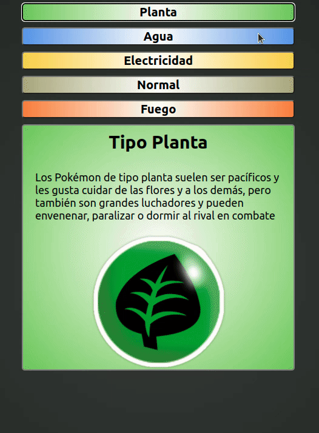

# Tarea

Para esta tarea tenemos como objetivo construir la siguiente aplicación  

## PokeType

Debe completar el archivo js/script.js para que la app realice lo que se ve en el gif:

- Debe conectar todos los botones al evento de "click" del mouse.
- Ese evento debe llamar a una función que reciba como parámetro el tipo de pokemon que se desea describir.
- Dentro de esa función utilizar condicionales para que según el tipo ingresado por parámetro, se realicen los cambios necesarios.
- Se debe cambiar el título (header) de la descripción.
- Se debe cambiar la descripción.
- Se debe cambiar la clase (el estilo) de la descripción según el tipo seleccionado.
- Se debe cambiar la imagen (src).

__NOTA__:
- Ya cuenta con la descripción de cada tipo en el archivo JS.
- Hay muchas formas de resolver este ejercicio, vaya por el camino que más cómodo le sea.
- ¡Cualquier duda con el enunciado nos conulstan!